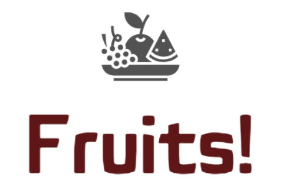

# Déployez un modèle dans le cloud
 

 
    
     
    <strong> Data Scientist </strong>

 

### Sommaire

- <a href="#C1">Présentation</a>

    - <a href="#C1.1">Données</a>

    - <a href="#C1.2">Mission</a>

    - <a href="#C1.3">Spécifications</a>

 

***
## <a name="C1">Présentation</a>
***

Je suis Data Scientist dans une très jeune start-up de l'AgriTech, nommée  ***"Fruits!"***, qui cherche à proposer des solutions innovantes pour la récolte des fruits.

***

    
        

***

La volonté de l’entreprise est de préserver la biodiversité des fruits en permettant des traitements spécifiques pour chaque espèce de fruits en développant des robots cueilleurs intelligents.

Le start-up souhaite dans un premier temps se faire connaître en mettant à disposition du grand public une application mobile qui permettrait aux utilisateurs de prendre en photo un fruit et d'obtenir des informations sur ce fruit.

Pour la start-up, cette application permettrait de sensibiliser le grand public à la biodiversité des fruits et de mettre en place une première version du moteur de classification des images de fruits.

De plus, le développement de l’application mobile permettra de construire une première version de l'architecture Big Data nécessaire.

***

### <a name="C1.1">Données:</a> 

Un jeu de données existe et constitué des images de fruits et des labels associés, qui pourra servir de point de départ pour construire une partie de la chaîne de traitement des données.

***

### <a name="C1.2">Mission:</a> 

Je suis chargé de développer dans ***un environnement Big Data*** une première chaîne de traitement des données qui comprendra ***le preprocessing*** et une étape de ***réduction de dimension***.

***

### <a name="C1.3">Spécifications:</a> 

* Je dois tenir compte dans mes développements du fait que le volume de données va augmenter très rapidement après la livraison de ce projet. Je développerais donc des ***scripts en Pyspark*** et utiliserez par exemple le ***cloud AWS*** pour profiter d’une ***architecture Big Data (EC2, S3, IAM)***, basée sur ***un serveur EC2 Linux***.
* La mise en œuvre d’une architecture Big Data sous (par exemple) AWS peut nécessiter une configuration serveur plus puissante que celle proposée gratuitement (EC2 = t2.micro, 1 Go RAM, 8 Go disque serveur).

